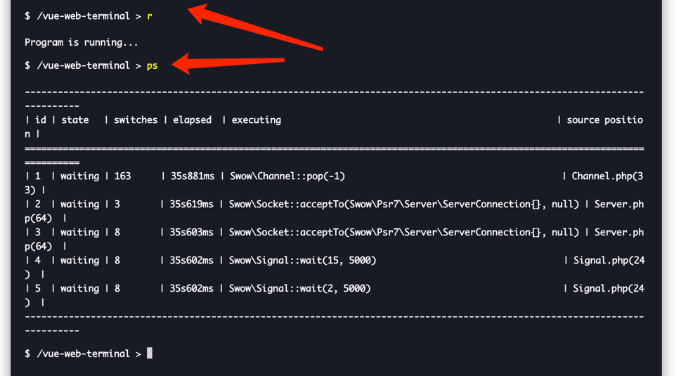
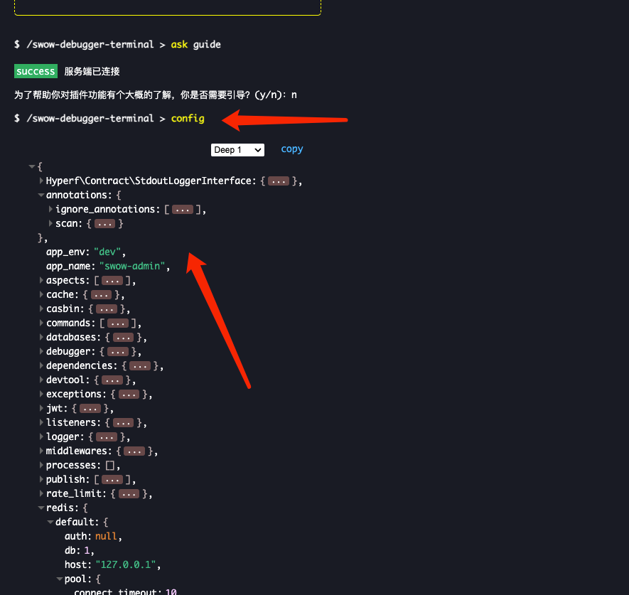

# swow-admin

**基于hyperf-swow开发的后台管理系统.**

# 生成ssl证书

```shell
 php bin/hyperf.php mkcert:command -d 127.0.0.1 -c ./ssl/localhost.pem -k ./ssl/localhost-key.pem

```

# Swow-RedLock

**通过阅读文章redis分布式锁进阶篇实现的基于swow实现的RedLock**

[redis 分布式锁进阶篇](https://mp.weixin.qq.com/s/3zuATaua6avMuGPjYEDUdQ)

# Swow-RedisLock

**基于swow实现的简单redis分布式锁**

# Casbin

# 使用box打包为二进制注意事项

1. 开启ssl证书的时候需要配置绝对路径不能通过`BASE_PATH`或者其他常量配置

2. Phar打包后是个包,不是源代码目录的形式，需要注意日志，或者其他文件写入的权限

# Github
[](https://git.io/streak-stats)

# Swow-Cloud


# SwowDebugger


# Swow-Debugger 功能介绍

Swow-Debugger 是一个在`web`端对 `Swow` 服务器进行深度调试的强大工具。以下是它所支持的一些主要功能：

## 1. 查看当前所有协程状态

可以使用 `ps` 命令来查看所有的当前协程状态。

## 2. 窥视协程

可以使用 co <id> 命令来查看特定的协程
```shell
co <id>
```

## 3. 进入协程
使用 attach <id> 命令可以进入到一个特定的协程。

```shell
attach <id>
```

## 4. 查看调用栈
使用 bt 命令可以查看函数调用栈

## 5. 查栈帧
使用 f <index> 命令，可以查看具体的栈帧。
```shell
f <index>
```
## 6. 打断点
使用 b 命令可以进行断点操作
```shell
b
```
## 7. 单步调试
使用 n 命令可以实现单步调试

## 9. 查看更多源码
l 命令用于查看更多的源代码

## 10. 打印变量
使用 p $var 命令可以打印变量的值。
```shell
p $var
```

## 11. 修改变量
使用 p $var = x 命令可以修改变量的值
```shell
p $var = x
```

## 12. 执行代码
使用 p command0 命令来执行代码。
```shell
p command0
```

## 13. 查看变量
使用 vars 命令，可以查看所有的变量

## 14. 扫描僵尸协程
z <时间> 命令用于扫描僵尸协程。
```shell
z <时间>
```

## 15. 杀死协程
使用 kill <id> 命令可以杀死特定的协程
```shell
kill <id>
```

## 16. 杀死所有协程
如果需要杀死所有的协程，可以使用 killall 命令。

## 17. 查看mysql,redis连接池
为了查看 mysql 和 redis 的连接池，可以使用 pool redis:name1,pool mysql:name2 
```shell
pool redis:name1,pool mysql:name2
```

## 18. 查看线上配置信息
`config`命令
```
config
```



